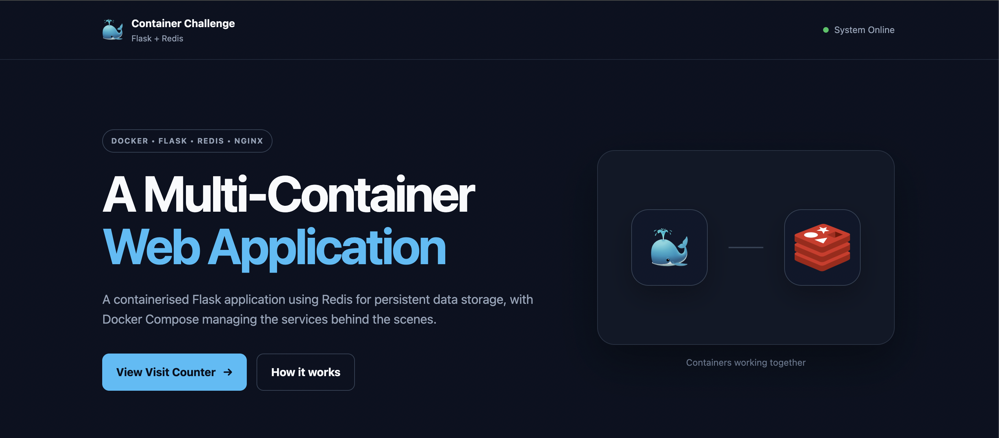
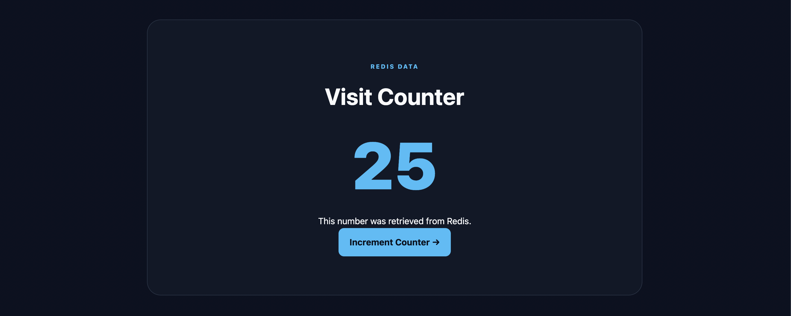

# 🐳 Multi-Container Flask + Redis Application

A containerised web application built with **Python, Flask, Redis, Docker Compose and Nginx**.

This project was created as part of a multi-container application challenge and demonstrates how multiple services can work together inside a Docker environment.



---

## 🚀 Overview

This application consists of several containers working together:

```text
                    ┌─────────────────┐
                    │     Browser     │
                    │ localhost:5003  │
                    └────────┬────────┘
                             │
                             ▼
                    ┌─────────────────┐
                    │      Nginx      │
                    │  Reverse Proxy  │
                    └────────┬────────┘
                             │
                 ┌───────────┴───────────┐
                 ▼           ▼           ▼
            ┌─────────┐ ┌─────────┐ ┌─────────┐
            │ Flask 1 │ │ Flask 2 │ │ Flask 3 │
            └────┬────┘ └────┬────┘ └────┬────┘
                 │            │            │
                 └────────────┼────────────┘
                              ▼
                       ┌─────────────┐
                       │    Redis    │
                       │ Visit Count │
                       └─────────────┘
```

The Flask application handles web requests, Redis stores the visit counter, and Nginx sits in front of the Flask containers.

---

## ✨ Features

* Flask web application
* Redis visit counter
* Dockerised application
* Docker Compose orchestration
* Redis persistent storage using a Docker volume
* Environment variables for Redis configuration
* Multiple Flask containers
* Nginx reverse proxy
* Responsive frontend
* Custom Docker/Redis themed UI

---

## 🛠️ Technology Stack

| Technology     | Purpose                        |
| -------------- | ------------------------------ |
| Python         | Application language           |
| Flask          | Web framework                  |
| Redis          | In-memory data store           |
| Docker         | Containerisation               |
| Docker Compose | Container orchestration        |
| Nginx          | Reverse proxy / load balancing |

---

## 📂 Project Structure

```text
container-challenge/
│
├── app.py
├── Dockerfile
├── docker-compose.yml
├── nginx.conf
├── requirements.txt
├── README.md
│
├── static/
│   ├── redis.png
│   └── style.css
│
├── templates/
│   └── index.html
│
└── screenshots/
    ├── homepage.png
    └── counter.png
```

---

## ⚙️ How It Works

### 1. Browser

The browser sends a request to:

```text
http://localhost:5003
```

### 2. Nginx

Nginx receives the request and forwards traffic to the Flask application containers.

### 3. Flask

Flask handles the request and renders the application interface.

When `/count` is requested, Flask increments the Redis counter.

### 4. Redis

Redis stores the visit count using the key:

```text
visits
```

Each request to `/count` increments this value.

### 5. Docker Compose

Docker Compose creates the network connecting the containers and provides the Redis connection details to Flask through environment variables.

---

## 🔐 Environment Variables

Flask reads the Redis connection information from environment variables:

```yaml
environment:
  REDIS_HOST: redis
  REDIS_PORT: 6379
```

The application reads these values using Python:

```python
os.environ.get("REDIS_HOST", "redis")
os.environ.get("REDIS_PORT", 6379)
```

This means the application doesn't have to hard-code the Redis connection details.

---

## 💾 Persistent Redis Storage

Redis uses a named Docker volume:

```yaml
volumes:
  - redis-data:/data
```

This allows Redis data to survive when the Redis container is removed and recreated.

To completely remove the stored Redis data:

```bash
docker compose down -v
```

---

## ▶️ Running the Application

Clone the repository:

```bash
git clone <your-repository-url>
```

Enter the project directory:

```bash
cd container-challenge
```

Build the containers:

```bash
docker compose build
```

Start the application with multiple Flask containers:

```bash
docker compose up --scale web=3
```

Then open:

```text
http://localhost:5003
```

To view and increment the Redis counter:

```text
http://localhost:5003/count
```

---

## 🛑 Stopping the Application

Press:

```text
Ctrl + C
```

or run:

```bash
docker compose down
```

---

## 📸 Screenshots

### Application Homepage


### Redis Visit Counter



---

## 🎯 What I Learned

This project helped me understand how multiple containerised services communicate with each other.

Key concepts covered:

* Building Docker images
* Creating Docker Compose services
* Container networking
* Connecting Flask to Redis
* Using environment variables
* Persistent Docker volumes
* Reverse proxies with Nginx
* Running multiple application containers
* Git and GitHub workflow

---

## 👨‍💻 Project

Built as a hands-on containerisation project using Flask, Redis and Docker.
